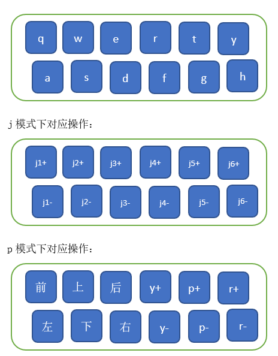

#Ti5robot

欢迎您使用Ti5robot机械臂，并感谢您的购买。

本文档记载了有关机械臂的安装、调试、以及如何基于API进行二次开发的相关信息。

机械臂使用人员应充分了解风险，使用前必须认真阅读本手册，严格遵守手册中的规范和要求。

## 简介

机械臂具有开放性的程序接口和拓展接口，机械臂末端可快速换装不同执行器；能够用于电商物流、新消费、日常生活等多种场景。

## SDK下载地址

+ SDK接口：[code](https://github.com/mrhouse-sweet/mechanical_arm_SDK-docs/tree/main/code)

## 注意事项

1.请务必按照本手册中的要求安装机械臂、连接线缆

2.确保机械臂的活动范围内不会碰撞到人或其他物品，以免发生意外

3.在使用前，需要专业的人员进行调试

4.在使用SDK时，必须确保输入的参数和操作流程是正确的

5.请注意机械臂运行速度，过快时务必小心

6.机械臂使用结束后，请务必断电

7.机械臂断电后，请务必将控制程序关闭

8.避免在潮湿或粉尘的环境下使用机械臂

9.请务必将机械臂存放、安装到儿童碰不到的地方，以免发生危险


# SDK介绍

机械臂控制的代码code中，分别是`include`，`src`，`log`以及`usrlib`。

+ [include](https://github.com/mrhouse-sweet/mechanical_arm_SDK-docs/tree/main/code/include) 存储着机械臂所需的头文件。
+ [src](https://github.com/mrhouse-sweet/mechanical_arm_SDK-docs/tree/main/code/src) 一般控制机械臂的文件放在此处，其中`main.cpp`是一个示例程序。
+ [log](https://github.com/mrhouse-sweet/mechanical_arm_SDK-docs/tree/main/code/log) sdk中存放log的文件夹。
+ [usrlib](https://github.com/mrhouse-sweet/mechanical_arm_SDK-docs/tree/main/code/usrlib)包含SDK所需的so文件

## 1. include

除以下提到的文件外，用户无需查看该文件夹下的其他文件。

### 1.1 mathfunc.h
机械臂的数学模型函数


### 1.2 Ti5BASIC.h

机械臂控制基础库，包含了基本控制以及信息，用户在使用时需要根据自身使用方式自行选择调用。

+ bool inspect_brake();
  ```
  函数功能：查询机械臂是否停止运动
  返回值：true停止，false未停止
  参数：无
  示例：bool result=inspect_brake()
  ```
+ void exit_progrem();//函数功能：退出程序
  ```
  函数功能：查询机械臂是否停止运动
  返回值：true停止，false未停止
  参数：无
  示例：
      int main()
      {
          login();
          cout<<"login success"<<endl;
          mechanical_arm_origin();
          sleep(3);
          show_value("pos:",TH.pos);
          cout<<endl;
          show_value("TH.j= ",TH.j);
          exit_progrem();
          while (1)
          {
              float arr1[6] = {2.2, -0.68, 2.22, 1.48, 1.56, 1.32};
              joint_movement(arr1);
              brake();
              show_value("TH.j= ", TH.j);
              arr1[5] = {2};
              printf("倒水\n");
              joint_movement(arr1);
              arr1[5] = {1.32};
              joint_movement(arr1);
              float arr3[6] = {1.78983, -0.732808, 2.05103, 1.07256, 1.71376, 1.39214};
              joint_movement(arr3);
              brake();
              show_value("TH.j= ", TH.j);
              joint_movement(arr3);
              printf("到达第2个点\n");
              arr3[5] = {2};
              joint_movement(arr3);
              printf("倒水\n");
              arr3[5] = {1.39214};
              joint_movement(arr3);
          }
          brake();
      }
  ```
+ void writeDebugInfoToFile(const char *func_name, const char *info);
  ```
  函数功能：将信息写入log中
  返回值：无
  参数：
      *func_name：函数名字
      *info：要写入log的信息内容
  示例：
      getCurrentposition->getParameter(canidList, reg_min_app_position, MotorTypeHelper::REG_MIN_APP_POSITION, IDNUM);
      for (int i = 0; i < 6; i++)
      {
            cout << "电机" << i << "最大负向位置: " << static_cast<int32_t>(reg_min_app_position[i]) << endl;
            sprintf(LogInfo, "电机%d最大正向位置: %d", i, static_cast<int32_t>(reg_min_app_position[i]));
            writeDebugInfoToFile(__func__, LogInfo);
      }
      cout << endl;
  ```

+ void login();
  ```
  函数功能：登录can设备
  返回值：无
  参数：无
  示例：
      login();
      getCurrentposition->getParameter(canidList, reg_min_app_position, MotorTypeHelper::REG_MIN_APP_POSITION, IDNUM);
      for (int i = 0; i < 6; i++)
      {
            cout << "电机" << i << "最大负向位置: " << static_cast<int32_t>(reg_min_app_position[i]) << endl;
            sprintf(LogInfo, "电机%d最大正向位置: %d", i, static_cast<int32_t>(reg_min_app_position[i]));
            writeDebugInfoToFile(__func__, LogInfo);
      }
      cout << endl;
  ```

+ void logout();//函数功能：登出can设备
    ```
  函数功能：登录can设备
  返回值：无
  参数：无
  示例：
      login();
      getCurrentposition->getParameter(canidList, reg_min_app_position, MotorTypeHelper::REG_MIN_APP_POSITION, IDNUM);
      for (int i = 0; i < 6; i++)
      {
            cout << "电机" << i << "最大负向位置: " << static_cast<int32_t>(reg_min_app_position[i]) << endl;
            sprintf(LogInfo, "电机%d最大正向位置: %d", i, static_cast<int32_t>(reg_min_app_position[i]));
            writeDebugInfoToFile(__func__, LogInfo);
      }
      cout << endl;
      logout();
  ```

+ std::vector<std::string> query_can();
  ```
  函数功能：查询can设备号
  返回值：无
  参数：无
  示例：
      vector<string> productSerialNumbers = query_can();
      if (productSerialNumbers.empty()) {
        cout << RED<<"未找到任何 USB 设备，请插入设备后重试！" <<RESET << endl;
        exit(0);
      } else {
        cout <<CYAN<< "找到的 CAN 设备序列号：" <<RESET;
        for (const string& serialNumber : productSerialNumbers) {
            cout << CYAN <<serialNumber <<RESET << endl;
        }
      }
  ```

+ void get_elc_info();
  ```
  函数功能：获取电机参数
  返回值：无
  参数：无
  示例：
      int main()
      {
          login();
          get_elc_info();
          logout();
          return 0;
      }
  ```

+ void set_elc_info(uint32_t *elc_parameterlist,int elc_num, int parameterType,uint32_t elc_value);
   ```
   函数功能：设置电机参数
   返回值：
   参数：
       elc_parameterlist 要设置的对应电机，
       elc_value 要设置的第n个电机，
       parameterType 要设置的项目，
       elc_value 新值
   示例：
       int main()
       {
           login();
           set_elc_info(reg_position_kp,0,MotorTypeHelper::REG_POSITION_KP, 500);
           set_elc_info(reg_position_kp,1,MotorTypeHelper::REG_POSITION_KP, 700);
           set_elc_info(reg_position_kp,2,MotorTypeHelper::REG_POSITION_KP, 800);
           set_elc_info(reg_position_kp,3,MotorTypeHelper::REG_POSITION_KP, 900);
           set_elc_info(reg_position_kp,4,MotorTypeHelper::REG_POSITION_KP, 1000);
           set_elc_info(reg_position_kp,5,MotorTypeHelper::REG_POSITION_KP, 1100);
           logout();
           return 0;
       }
   ```
+ bool get_electricity_status();
  ```
  函数功能：获取各关节电机电流值
  返回值：true为无异常，false为异常
  参数：无
  示例：
      int main()
      {
           login();
           if(get_electricity_status() != true)
            {
              cout << "电机异常！" << endl;
            }
           logout();
           return 0;
       }
  ```
+ int get_elektrische_Maschinen_status();
  ```
  函数功能：获取机械臂错误状态
  返回值：
      0：无错误
      1：软件错误
      2：过压
      4：欠压
      16：启动错误
  参数：无
  示例：
      int main()
      {
           login();
           int num = get_elektrische_Maschinen_status();
           logout();
           return 0;
       }
  ```
+ void clear_elc_error();
  ```
  函数功能：清除电机错误
  返回值：无
  参数：无
  示例：
      int main()
      {
          login();
          if(get_electricity_status() != true)
          {
              cout << "电机异常！" << endl;
          }
          clear_elc_erro();
          logout();
          return 0;
       }
  ```
+ int uart485_communication(char *device_485_name);
  ```
  函数功能：485通信功能，通信协议见《钛虎485通信协议.xlsx》
  返回值：设备名称
  参数：失败返回-1，成功返回0
  示例：
      int main()
      {
          login();
          uart485_communication("/dev/ttyUSB0");
          logout();
          return 0;
       }
  ```
  

### 1.3 Ti5LOGIC.h

该文件是机械臂的算法库，包括正逆解，碰撞检测，规划路径等。
使用方法：根据需求在规划机械臂运动的时候可以调用该库的函数。

### 1.4 Ti5MOVE.h

机械臂运动控制库，包含的功能有直线运动，圆弧运动，机械臂初始化，机械臂手动模式控制，机械臂关节运动，机械臂坐标运动，获取机械臂当前角度值，获取机械臂当前位姿，机械臂刹车，查看机械臂是否停止运动，机械臂手动规划路径点并记录到文件中，机械臂加载路径文件。

+ void mechanical_arm_origin();
  ```
  函数功能：机械臂初始化位置
  返回值：无
  参数：无
  示例：
      int main()
      {
          login();
          mechanical_arm_origin();
          logout();
          return 0;
       }
  ```

+ void keyboard_controller();
  ```
  函数功能：机械臂手动模式
  返回值：无
  参数：无
  示例：
      int main()
      {
          login();
          mechanical_arm_origin();
          keyboard_controller();
          logout();
          return 0;
       }
  ```
可选直接关节控制（j）或末端位姿控制（p），两种模式下12个键盘按键
<center>

<br>
<div style="color:orange; border-bottom: 0.1px solid #d9d9d9;
display: inline-block;
color: #999;
padding: 1px;"></div>
</center>
<br>

+ void joint_movement(const float *arr);
   ```
  函数功能：机械臂关节运动
  返回值：无
  参数：各个关节值
  示例：
     int main()
      {
          login();
          mechanical_arm_origin();
          float arr[6]={2.3,3.2,2.2,0,0,0};
          joint_movement(arr);
          logout();
          return 0;
       }
  ```


+ void pos_movement(const float *arr);
  ```
  函数功能：机械臂坐标运动
  返回值：无
  参数：坐标点
  示例：
     int main()
      {
          login();
          mechanical_arm_origin();
          float arr[6]={-7.01863, 311.595, 2.588, -2.02847, -3.11001, 0.0560048};
          pos_movement(arr);
          logout();
          return 0;
       }
  ```

+ bool circle_move(float O[3], float U[3],float K, float startN[6]);
   ```
  函数功能：圆弧运动，逆时针是正方向，
  返回值：成功true，失败false
  参数：O圆心(围绕哪个点)，U法向量（确定圆是在哪个面转），K圆心角（0~2PI），startN起始点
  示例：
     int main()
      {
          login();
          mechanical_arm_origin();
          float _o[3]=(3.4,311.59,2.58);
          float _u[3]=(3.4,211.59,2.00);
          float arr[6]={-7.01863, 311.595, 2.588, -2.02847, -3.11001, 0.0560048};
          circle_move(_o,_u,arr);
          logout();
          return 0;
       }
  ```


+ int current_angle();
   ```
  函数功能：获取当前角度
  返回值：成功返回1，失败返回-1
  参数：无
  示例：
     int main()
      {
          login();
          mechanical_arm_origin();
          current_angle();
          logout();
          return 0;
       }
  ```


+ void linear_move(Point start, Point end,float stepSize);
   ```
  函数功能：直线运动规划
  返回值：无
  参数：start：起点 ，end：终点，stepSize：步长
  示例：
     int main()
      {
          login();
          mechanical_arm_origin();
          Point start[1];
          Point end[1];
          cout << "请输入起始点坐标x, y, z" << endl;

          for (int i = 0; i < 1; i++)
          {
            cin >> start[i].x;
            cin >> start[i].y;
            cin >> start[i].z;
          }

          cout << "请输入终点坐标x, y, z" << endl;
          for (int j = 0; j < 1; j++)
          {
            cin >> end[j].x;
            cin >> end[j].y;
            cin >> end[j].z;
          }
          linear_move(start[0],end[0],20);
          logout();
          return 0;
       }
  ```


+ int current_pose(float posz[]);
   ```
  函数功能：获取当前位姿
  返回值：成功返回0，失败返回-1
  参数：存放位置的数组中
  示例：
     int main()
      {
          login();
          mechanical_arm_origin();
          float arr[6];
          current_pose(arr);
          logout();
          return 0;
       }
  ```


+ bool brake();
   ```
  函数功能：机械臂刹车
  返回值：成功返回true
  参数：无
  示例：
     void signalHandler(int signum)
     {
        char aaa;
        cout << "Interrupt signal (" << signum << ") received.\n";
        brake();  
        cout << "stop!!" << endl;
        inspect_brake(); 
        logout();
        exit(signum);
     }
  ```


+ bool IsBrake();//机械臂是否停止运动
     ```
  函数功能：机械臂刹车
  返回值：成功返回true
  参数：无
  示例：
     void signalHandler(int signum)
     {
        char aaa;
        cout << "Interrupt signal (" << signum << ") received.\n";
        brake();  
        cout << "stop!!" << endl;
        inspect_brake(); 
        logout();
        exit(signum);
     }
  ```


### 1.5 tool.h

该文件是一些`tool`，具体函数使用及参数请查看该文件。

### 1.6. can
该文件夹包含`can`通讯的头文件，机械臂是通过can通讯与控制机联通的，具体函数功能及参数请查看里面所包含的文件中注释了解函数作用。

### 1.7. clamping_jaw.h
该文件夹是夹爪功能函数
+ int clamp_jaw_close(const std::string& pythonPath);
   ```
  函数功能：夹爪合
  返回值：成功返回0，失败返回-1
  参数：无
  示例：
  ```


+ int clamp_jaw_open(const std::string& pythonPath);
     ```
  函数功能：夹爪开
  返回值：成功返回0，失败返回-1
  参数：无
  示例：
     std::string path = "/home/ubuntu/.local/lib/python3.10/site-packages";
     while(1){
         clamp_jaw_open(path);
         sleep(2);
         clamp_jaw_close(path);
         sleep(2);
    }
  ```
### 1.8. socket_service.h
+ int socket_server(std::string& serverIP,int port);
   ```
   函数功能：socket连接函数，按照通信协议接收坐标和命令，通信协议见《钛虎socket通信协议.xlsx》
   返回值：成功返回0，失败返回1
   参数：serverIP 服务器地址，port 服务器端口号
   示例：
     int main()
      {
          login();
          mechanical_arm_origin();
          socket_server(ip_test,12345);
          logout();
          return 0;
       }
   ```
## 3.src
### 3.1 main.cpp

该文件是一个简单的示例程序，调用了`Ti5BASIC.h`中的`query_can()`函数，首先查找是否连接了can设备，然后调用`mechanical_arm_origin()`让机械臂回到初始位置，接下来调用`tool.h`中的`show_value()`函数，显示此时的位姿信息，还有一个简单的类似码垛的动作。

### 3.2 gcc.sh

该文件中的内容是编译命令，编译的时候可以使用该命令直接编译，也可以使用g++命令+对应参数直接编译

### 3.2 编译

最后执行`gcc.sh`文件进行编译或通过以下命令进行编译生成可执行文件`move_sov`。(注意：以下路径是默认路径，如果修改了路径要替换成自己的)
```
g++ main.cpp  -L./include -lmylibti5 -L./include/can -lmylibscan -lcontrolcan -lspdlog -lfmt -ludev -o move_sov
```
**运行**:
```
sudo ./move_sov
```
注意机械臂处在一个安全的环境中

## 解算器说明
（1）地面定义为基坐标中z=0的平面。

（2）原始关节角度区间（不考虑碰撞）：逆运动j解集[-pi,pi)，正运动j定义域[-pi,pi]；正运动ypr解集，p属于[-pi,pi)，r、y属于pi/2~pi/2，逆运动ypr定义域[-pi,pi)。

（3）逆运动原始解空间（不考虑碰撞）为半径一定的球，球心坐标随ypr改变。

（4）在末端三个关节自由旋转360度的情况下设置了静态的碰撞区间。

（5）逆运动的解通过对比变换矩阵判断正确性。


## 开发须知
（1）代码中一切角大小相关的量采用弧度制（bais由角度制自动转向弧度制）。

（2）机械臂的一切控制基于robotArm类，传参方式为直接改变TH.j或TH.pos的值。

（3）TH.j与TH.pos代表数学模型的理论值，需要借由bais校准到实际发送的理论值。

（4）相邻两次指令发送时间低于USLEEPTIME可能信息堵塞。

（5）由于电机内部的算法，指令发送的值与实际执行的值有微小误差。

（6）位置环与速度环都是直接控制电机内圈，因此从外到内涉及scale的放缩。“位置环参数”单位为“步”，“速度环参数/100”单位为“圈/秒”。一圈65536步。

（7）move函数的参数mode，值0为各关节位置环直接到达，1为匀速同时到达，2为匀加速度率同时到达。在改变量过小时匀加速度率模式会转成匀速模式。
