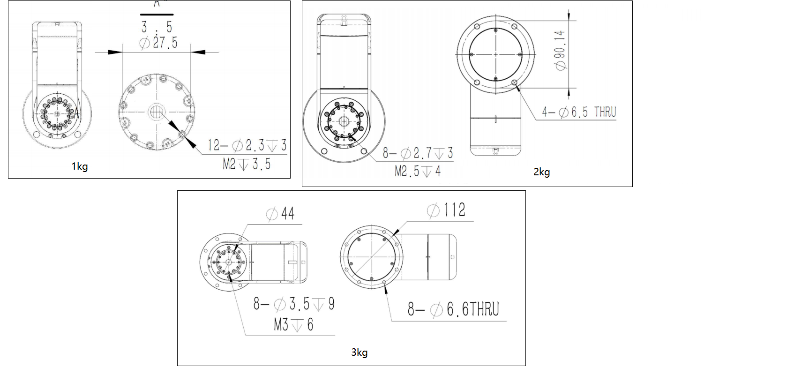
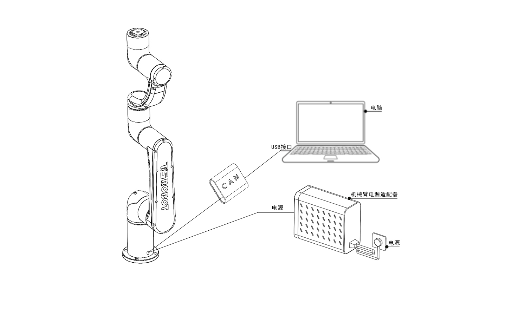

# 机械臂安装

## 固定机械臂

用户在固定机械臂时可根据机械臂底座孔位尺寸及真实环境自行设计安装台架，机械臂的固定台架不仅需要承受机械臂自身的重量，还要承受最大加速度运动时的瞬时动态作用力。
机械臂使用若干颗颗M6螺栓，用内六角扳手安装机械臂。底座安装图如下

 

 

## 线缆连接

机械臂线缆主要有两种：供电线和通信线。机械臂供电线的接头具备防呆功能，将机械臂的供电线与电源线连接。同时将通信线连接电脑。

 

机械臂线缆连接图

 

