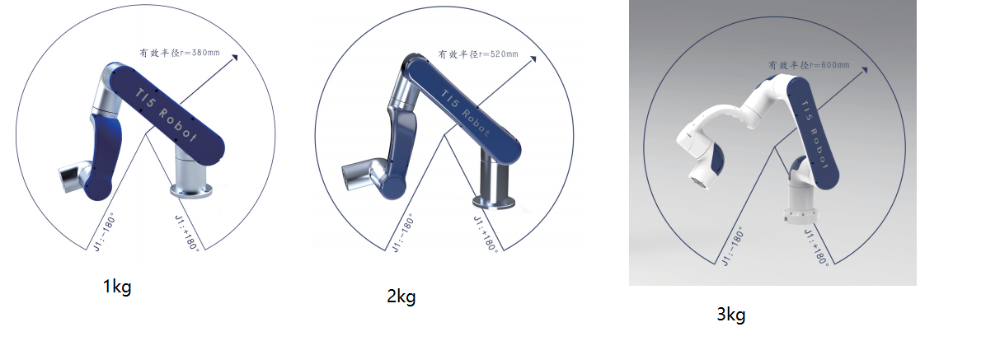
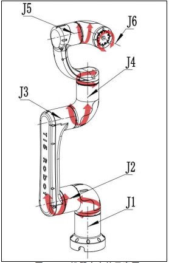
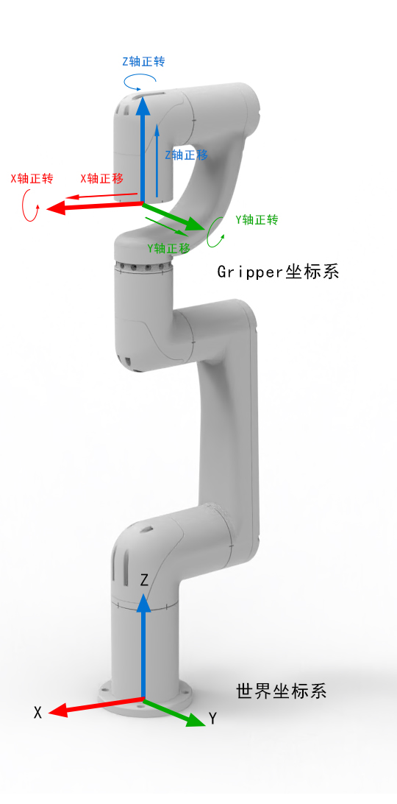
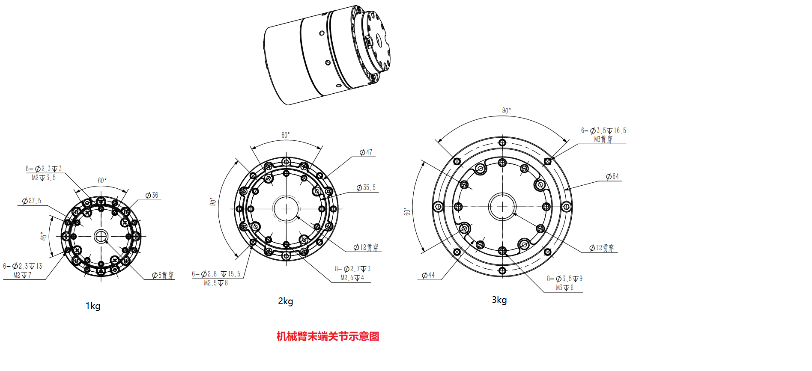

# 规格参数

|型号|Ti5 Robot Eblm-1|Ti5 Robot Eblm-2|Ti5 Robot Arm-3|
|:-:|:-:|:-:|:-:|
|自由度|6轴|6轴|6轴|
|自重|2.6kg|4.5kg|9.7kg|
|负载|1kg|2kg|3kg|
|工作半径|380mm|520mm|600mm|
|重复定位精度|+/-0.05mm|+/-0.05mm|+/-0.05mm|
|关节范围|J1(+/-180°) J2(-265°~85°) J3(+/-150°) J4(+/-180°) J5(+/-175°) J6(+/-175°)|J1(+/-180°) J2(-265°~85°) J3(+/-150°) J4(+/-180°) J5(+/-175°) J6(+/-175°)|J1(+/-180°) J2(-265°~85°) J3(+/-150°) J4(+/-180°) J5(+/-175°) J6(+/-175°)|
|电机|柔性力矩电机+谐波减速器|柔性力矩电机+谐波减速器|柔性力矩电机+谐波减速器|
|电源需求|DC 48V，5A；DC 28V，5A|DC 48V，5A；DC 28V，5A|DC 48V，5A；DC 28V，5A|
|接口|Can|Can|Can|
|用户控制系统|Ubuntu 22.04|Ubuntu 22.04|Ubuntu 22.04|
|典型功耗|300W|600W|600W|

## 机械臂运动范围

## 旋转方向及坐标系

### 关节坐标系

 

机械臂关节序号及关节转动正方向定义

 

### 笛卡尔坐标系

 

笛卡尔空间控制

 

## 末端关节

 

 

其中手爪装载平面（即J6末端平面）的绝对初始位置为[0, 1.5708, 0]，即无手爪时的笛卡尔系末端计算位姿。
